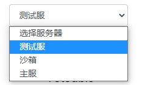
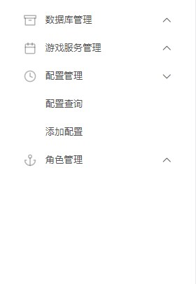
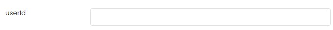
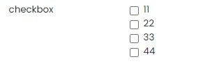
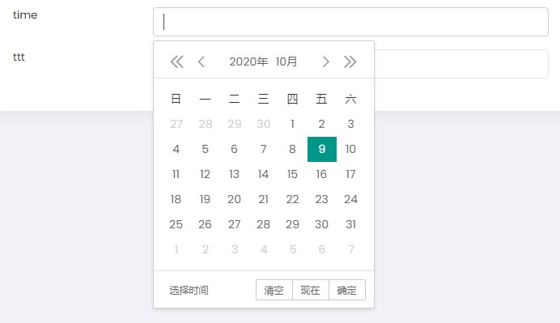

# Vertx-DynamicGmManager
* 基于vertx设计的可自由设计功能模块的动态游戏后台管理系统
    - 通过编辑properties.xml文件改变系统功能
    - 收发json来管理远端游戏的后台数据
## 技术选型
+ 后端
    + Vertx
    + RSA
    + JWT
    + Thymeleaf
    + Jdom
    + Mysql(Database branch)
    + Redis(Database branch)
    + DBPool(Database branch)
    + Durid(Database branch)
+ 前端
    + Node.js
    + Ajax
    + jsencrypt
##properties.xml编写规范
* 必须编写根元素system
* 根元素下分为两个元素：servers和pages
### servers编写规范  
servers元素用来表示服务器的相关配置  

```
<servers>
    <server name="沙箱" value="sandbox" host="localhost" port="8000" url="/GmServer"/>
    <server name="测试服" value="test" host="localhost" port="8000" url="/GmServer"/>
    <server name="主服" value="master" host="localhost" port="8000" url="/GmServer"/>
</servers>
``` 
- server元素代表着一个服务器及相关信息          
    * name属性为服务器的中文名字，用于展示给用户选择
    * value属性为服务器的英文名字，用于后台传递值
    * host属性为服务器的主机地址
    * port属性为服务器的端口号
    * url属性为需要访问的路由
### pages元素编写规范  
pages元素表示所有的页面及页面的类别和内容


```
     <pages>
        <pageType name="角色管理" authorization="playerManage" icon="anchor">
                <page name="用户管理" authorization="addUser" type="userManage">
                    <form name="添加用户" operation="addUser">
                        <input type="text" name="用户名" id="username"/>
                        <input type="text" name="密码" id="password"/>
                        <input type="button" id="userManage" value="添加用户"/>
                    </form>
                </page>
                <page name="权限管理" authorization="selectAuthList" type="userAuthManage" list="selectUserList">
                </page>
            </pageType>
            <pageType name="数据库管理" authorization="databaseManage" icon="archive">
                <page name="修改金币/钻石" authorization="updatePlayerValue" list="selectPlayerName">
                </page>
        </pageType>
    </pages>
```
- pageType代表着一个类别的页面，是一级目录，可以展开查看其类别下的子页面
    * name属性为类别的中文名，用于给用户展示
    * authorization属性为类别的英文名，用于后台分配权限
    * icon属性为类别的图标样式
- page元素表示一个页面及其内容
    * name属性为该页面的中文名，用于给用户展示
    * authorization属性为该页面的英文名，用于传值
    * type属性为该页面所属的类别
    * list属性表示该页面有需要预加载的右侧列表，没有时可以不添加该属性
    * table属性表示该页面有需要预加载的下方表格，没有时可以不添加该属性
    * listId属性表示右侧列表绑定的下方输入框，如果没有则默认绑定第一个输入框
####page内元素编写规范
page内可以添加许多html中的控件，但是必须在form内添加这些控件。一个page内可以有多个form。
```
<page name="开关游戏服" authorization="queryAsset">
    <form name="queryAsset" operation="selectTableData">
        <input type="text" name="userId">0</input>
        <input type="text" name="days">0</input>
        <select name="sel">
            <option value="1">广州</option>
            <option value="2">深圳</option>
            <option value="3">山东</option>
            <option value="4">北京</option>
        </select>
        <formcheck name="radio">
            <radio value="11">11</radio>
            <radio value="22">22</radio>
            <radio value="333">33</radio>
            <radio value="444">44</radio>
        </formcheck>
        <formcheck name="radio">
            <checkbox value="11">11</checkbox>
            <checkbox value="22">22</checkbox>
            <checkbox value="333">33</checkbox>
            <checkbox value="444">44</checkbox>
        </formcheck>
        <input type="file" name="sendfile"/>
        <time name="time"/>
        <input type="button" name="ttt">提交</input>
    </form>
</page>
```
- form元素代表着一个表单
    * name属性为该表单的中文名
    * operation属性为该表单要进行的操作
- form元素中的子元素
    * input元素
        ```xml
        <input type="text" name="name" id="name"/>
        ```
        > input元素代表着在form中添加一个input标签，可以类比html中的input标签。
        > - type属性代表着input的种类，可以是text、file、button，分别代表着文本框，文件输入框，按钮。  
        > - name属性为该元素的名字，除了type为button的input可以省略其余都必须添加。  
    * select元素
        ```
            <select name="sel">
                <option value="1">广州</option>
                <option value="2">深圳</option>
                <option value="3">山东</option>
                <option value="4">北京</option>
            </select>
        ```
        > select元素代表着下拉框 
        > - name属性代表着这个下拉框的名字 
        > - 下拉框的子元素为option，代表着每一个选项的元素
        > - option标签的value属性代表着这个选项的值  
        > - option标签的内容代表着这个选项的中文名字        
        
          
          
          
    * formcheck元素
        ```
            <formcheck name="radio">
                <radio value="11">11</radio>
                <radio value="22">22</radio>
                <radio value="333">33</radio>
                <radio value="444">44</radio>
            </formcheck>
            <formcheck name="radio">
                <checkbox value="11">11</checkbox>
                <checkbox value="22">22</checkbox>
                <checkbox value="333">33</checkbox>
                <checkbox value="444">44</checkbox>
            </formcheck>
        ```
        > formcheck元素代表着选项框，name为选项框的名字，必须填写
        > 1. 当子元素为radio，选项框为单选框
        > 2. 当子元素为checkbox时，选项框为复选框
        
          
          
    * time元素
        ```
           <time name="time"/>
        ``` 
        > time元素代表着时间选择框，name为时间框的名字
        
          
## Database.xml文件数据库
* 系统为轻便起见采用文件数据库对用户数据进行管理
* Database分支中为采用数据库管理用户的方案
### 文件数据库规则
- 数据库最外层标签
    ```
    <database>
        <!--  管理员数据  -->
    </database>
    ```
- 用户记录
    - 分为四个column
    - name为column名，value为column值
    ```
    <record>
        <column name="username" value="root" />
        <column name="password" value="root" />
        <column name="token" value="token" />
        <column name="auth" value="sup">
            <!--  权限数据  -->
        </column>
    </record>
    ```
- 权限数据
    - 权限按照不同服务器进行划分
    - 权限种类为list与btn两种，list为目录权限，btn为按钮权限
    - 权限名需与properties.xml中的权限对应，拥有该权限即代表可以打开或使用该页面或按钮
    - 权限column中的value有"sup"与"ord"两种，前者可以打开最高管理员权限页面
    ```
    <column name="auth" value="sup">
        <auth1 name="server" value="sandbox">
            <auth2 type="list" value="databaseManage" />
            <auth2 type="btn" value="selectConfig" />
        </auth1>
        <auth1 name="server" value="test">
            <auth2 type="list" value="databaseManage" />
            <auth2 type="btn" value="selectConfig" />
        </auth1>
        <auth1 name="server" value="master">
            <auth2 type="list" value="databaseManage" />
            <auth2 type="list" value="gameManage" />
            <auth2 type="btn" value="selectConfig" />
        </auth1>
    </column>
    ```
